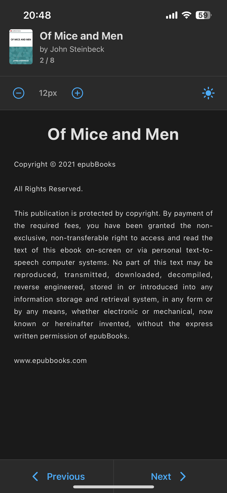
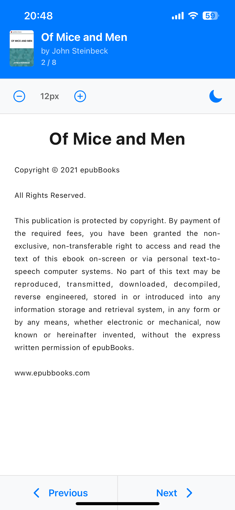

# 📚 EPUB Reader for React Native

A beautiful, lightweight EPUB reader built with React Native and Expo. Parse and display EPUB books with a modern, customizable reading experience.




## ✨ Features

- **📖 Pure React Native Implementation** - No WebView dependencies, native text rendering for better performance
- **🎨 Beautiful UI** - Modern, clean interface with smooth animations
- **🌓 Dark Mode** - Automatic system theme detection with manual toggle
- **🔤 Font Size Controls** - Adjustable text size (12px - 32px) for comfortable reading
- **🖼️ Cover Image Display** - Automatic cover extraction and display
- **📑 Smart Chapter Navigation** - Extract chapter titles and navigate seamlessly
- **📋 List Support** - Proper handling of table of contents and nested lists
- **🔍 Robust EPUB Parsing** - Supports both EPUB 2 and EPUB 3 formats
- **⚡ Lightweight** - Minimal dependencies, fast loading

## 🎯 Why This Project?

### Common Problems Solved

1. **iOS File Access Issues** - Most EPUB readers using WebView face `file://` URI restrictions on iOS. This implementation uses native text rendering, avoiding these issues entirely.

2. **Attribute Ordering** - EPUB metadata can have XML attributes in different orders. This parser handles both `name="cover" content="id"` and `content="id" name="cover"` formats.

3. **List Formatting** - Many readers don't properly handle `<ol>`, `<ul>`, and nested lists in EPUB files. This implementation converts lists to readable bullet points.

4. **Text Extraction** - Properly extracts text from HTML while preserving paragraph structure and removing formatting artifacts.

5. **Cover Image Extraction** - Handles multiple cover image formats (EPUB 2 meta tags, EPUB 3 properties, manifest lookups).

### Unique Value

- **Educational** - Clean, well-documented code showing how EPUB files work internally
- **Lightweight** - Uses JSZip instead of heavy native modules
- **Modern Stack** - Built with Expo SDK 54, React 19, and TypeScript
- **Cross-Platform** - Works on iOS, Android, and Web
- **No Native Code** - Pure JavaScript/TypeScript implementation

## 🚀 Quick Start

### Prerequisites

- Node.js 18+ 
- npm or yarn
- Expo CLI (optional, but recommended)

### Installation

1. Clone the repository:
```bash
git clone https://github.com/yourusername/epub-reader.git
cd epub-reader
```

2. Install dependencies:
```bash
npm install
```

3. Start the development server:
```bash
npx expo start
```

4. Open on your device:
   - Press `i` for iOS simulator
   - Press `a` for Android emulator
   - Scan QR code with Expo Go app

## 📦 Adding Your EPUB Files

Place your EPUB files in the `assets/books/` directory:

```
assets/
  books/
    your-book.epub
    another-book.epub
```

Then update the file path in `app/index.tsx`:

```typescript
const asset: Asset = Asset.fromModule(
  require('../assets/books/your-book.epub')
);
```

## 🏗️ Project Structure

```
epub-reader/
├── app/
│   ├── _layout.tsx      # Root layout with theme provider
│   └── index.tsx        # Main EPUB reader component
├── assets/
│   ├── books/           # Place your EPUB files here
│   └── images/          # App icons and screenshots
├── components/           # Reusable UI components
├── constants/           # Theme constants
├── hooks/               # Custom React hooks
└── metro.config.js      # Metro bundler config for EPUB files
```

## 🔧 How It Works

### EPUB Parsing Pipeline

1. **Asset Loading** - Loads EPUB file using Expo Asset API
2. **Base64 Conversion** - Converts file to base64 for JSZip
3. **Unzip** - Extracts EPUB archive (EPUBs are ZIP files)
4. **Container Parsing** - Reads `META-INF/container.xml` to find OPF path
5. **OPF Parsing** - Extracts metadata and reading order from OPF file
6. **Metadata Extraction** - Gets title, author, and cover image
7. **Chapter Extraction** - Processes each chapter file in reading order
8. **HTML to Text** - Converts XHTML to clean, readable text
9. **Rendering** - Displays content in React Native components

### Key Components

- **`loadEpub()`** - Main loading function that orchestrates the parsing
- **`extractMetadata()`** - Extracts book metadata from OPF
- **`extractChapters()`** - Processes chapters in reading order
- **`extractTextFromHtml()`** - Converts HTML to formatted text
- **`extractTitle()`** - Extracts chapter titles from HTML

## 🎨 Customization

### Theme Colors

Edit the theme object in `app/index.tsx`:

```typescript
const theme = {
  background: isDark ? '#1a1a1a' : '#ffffff',
  primary: isDark ? '#4dabf7' : '#007AFF',
  // ... more colors
};
```

### Font Size Range

Adjust the min/max font size:

```typescript
const increaseFontSize = (): void => {
  if (fontSize < 32) setFontSize(fontSize + 2); // Max 32px
};

const decreaseFontSize = (): void => {
  if (fontSize > 12) setFontSize(fontSize - 2); // Min 12px
};
```

## 📚 EPUB Format Support

This reader supports:

- ✅ EPUB 2.0
- ✅ EPUB 3.0
- ✅ Dublin Core metadata
- ✅ Cover images (multiple formats)
- ✅ Table of contents
- ✅ Nested lists
- ✅ HTML entities
- ✅ Multiple chapter formats

## 🤝 Contributing

Contributions are welcome! Please feel free to submit a Pull Request.

### Areas for Contribution

- [ ] Book library/list view
- [ ] Reading position persistence
- [ ] Bookmarks and notes
- [ ] Search functionality
- [ ] Text-to-speech integration
- [ ] Better image support
- [ ] Footnotes handling
- [ ] Performance optimizations

## 📝 License

This project is open source and available under the [MIT License](LICENSE).

## 🙏 Acknowledgments

- Built with [Expo](https://expo.dev)
- EPUB parsing with [JSZip](https://stuk.github.io/jszip/)
- Icons from [@expo/vector-icons](https://expo.github.io/vector-icons/)

## 📖 Learn More

- [EPUB 3 Specification](https://www.w3.org/publishing/epub3/)
- [Expo Documentation](https://docs.expo.dev/)
- [React Native Documentation](https://reactnative.dev/)

---

**Made with ❤️ for the reading community**
